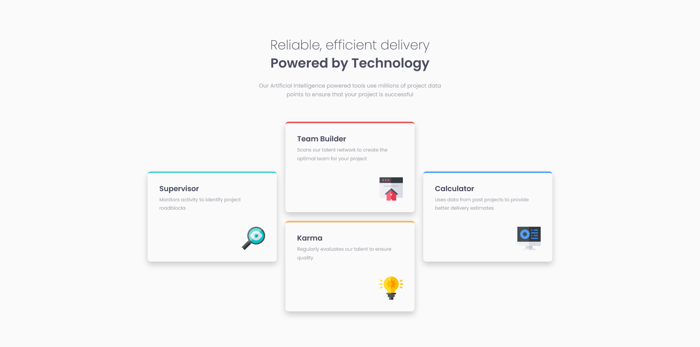

# Frontend Mentor - Four card feature section solution

This is a solution to the [Four card feature section challenge on Frontend Mentor](https://www.frontendmentor.io/challenges/four-card-feature-section-weK1eFYK). Frontend Mentor challenges help you improve your coding skills by building realistic projects.

### Screenshot

### Links

- Solution URL: [Frontendmentor Solution Page](https://www.frontendmentor.io/solutions/four-card-feature-section-vdDBXsxgHx)
- Live Site URL: [GitHub Pages Site](https://karolbanat.github.io/four-card-feature-section/)

## Author

- Frontend Mentor - [@karolbanat](https://www.frontendmentor.io/profile/yourusername)
